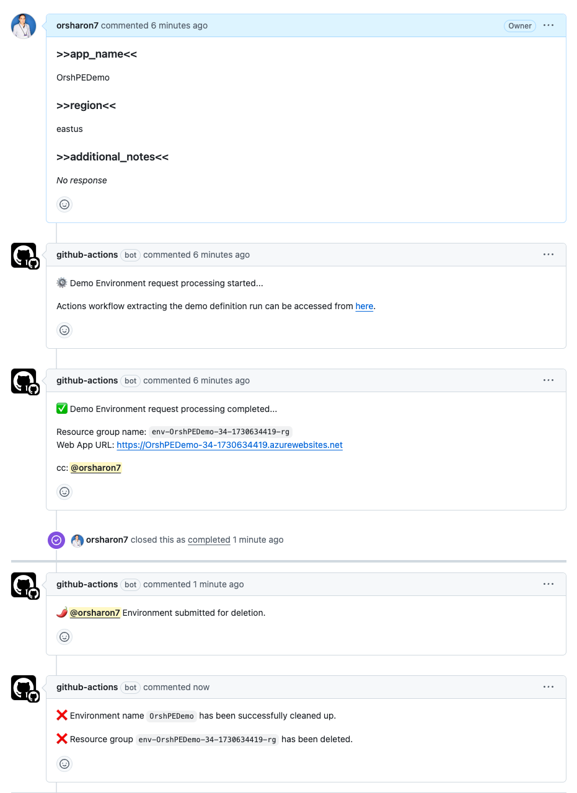
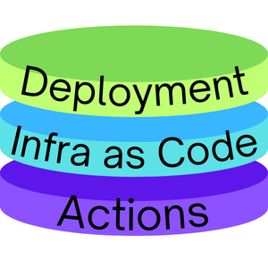

# Platform Engineering with Github Workshop

Welcome to the Platform Engineering Workshop! This workshop is designed to help you understand the benefits of platform engineering, how it works, and what we've accomplished in this project.

## Table of Contents

1. [Introduction](#introduction)
2. [Benefits of Platform Engineering](#benefits-of-platform-engineering)
3. [Workshop Overview](#workshop-overview)
4. [Project Structure](#project-structure)
5. [How It Works](#how-it-works)
    - [Opening an Issue](#opening-an-issue)
    - [Provisioning Environments](#provisioning-environments)
    - [Destroying Environments](#destroying-environments)
6. [Getting Started](#getting-started)
7. [Conclusion](#conclusion)

## Introduction

Platform engineering is the practice of designing and building toolchains and workflows that enable self-service capabilities for software engineering organizations in the cloud-native era. This workshop will guide you through the key concepts and practical implementations of platform engineering.

## Why We Need Platform Engineering

Imagine a traditional office setup. Alex, a developer, needs a testing environment for a new feature. The workflow is tedious: Alex submits a request to the IT department, who then forwards it to an infrastructure specialist. Days pass as configurations are prepared, approvals are obtained, and resources are allocated. During this wait, Alex is stalled, productivity drops, and team momentum slows.

Now, with platform engineering, everything changes. Alex uses a self-service platform. By simply opening a GitHub issue and selecting the environment specifications, an automated workflow is triggered. Within minutes, the necessary infrastructure is provisioned in the cloud, complete with monitoring and compliance standards. Alex can immediately begin testing, without the inefficiencies of manual processes.

This transformation highlights the essence of platform engineering: removing bottlenecks, empowering developers, and accelerating the software delivery lifecycle.

### How it looks like?
<div style="text-align: center;">
    
</div>


## Benefits of Platform Engineering

- **Increased Developer Productivity**: Platform engineering empowers developers to work autonomously by offering self-service access to the infrastructure they need. This eliminates the waiting times associated with manual provisioning and allows engineers to focus more on coding and delivering features, ultimately accelerating development cycles.

- **Consistency and Standardization**: By leveraging Infrastructure as Code (IaC) and automated workflows, environments are created and managed in a uniform manner. This reduces the risk of misconfigurations, configuration drift, and human errors, making debugging and troubleshooting more efficient.

- **Scalability**: With standardized processes and automation in place, scaling infrastructure becomes a seamless task. Resources can be added or removed dynamically based on demand, ensuring that the system can handle varying loads while maintaining performance and reliability.

- **Cost Efficiency**: Automated cleanup and optimized resource allocation ensure that only necessary resources are used, reducing waste and lowering costs. Platform engineering practices also make it easier to forecast and control expenses, aligning resource usage with business goals.

## The Three Layers of Platform Engineering

Platform engineering delivers efficient, automated workflows through three essential layers: Infrastructure as Code (IaC), Actions, and Deployment.


### 1. **Infrastructure as Code (IaC) Layer**
   The foundation of a robust platform: this layer uses code to define and manage infrastructure. Tools like Terraform, ARM templates, and Pulumi automate resource provisioning, making it scalable and consistent.<br>
   - **Examples**:
     - Automating network and database setup with Terraform.
     - Using ARM templates to ensure uniform infrastructure across environments.
     - Version-controlling cloud policies for consistent security.

### 2. **Actions Layer**
   The automation hub: this layer focuses on orchestrating CI/CD workflows, testing, and deployment triggers. GitHub Actions and Jenkins streamline the build and release processes, ensuring efficient software delivery.<br>
   - **Examples**:
     - Automatically running infrastructure checks with GitHub Actions.
     - Integrating quality assurance tests in every code commit.
     - Coordinating complex deployment workflows to multiple environments.

### 3. **Deployment Layer**
   Where software goes live: this layer ensures applications are deployed securely and efficiently using technologies like Helm, Azure App Services, and Docker. It focuses on making deployments fast, reliable, and easily manageable.<br>
   - **Examples**:
     - Rolling out microservices with Helm while monitoring performance.
     - Using Azure App Services for automated scaling and management.
     - Deploying and managing containerized apps with Docker in a multi-cloud setup.

Together, these layers form a cohesive platform, optimizing infrastructure management and streamlining the developer experience.


## Workshop Overview

In this workshop, you will learn how to:

1. Provision and manage development environments using GitHub Actions.
2. Deploy infrastructure as code using Azure Resource Manager (ARM) templates.
3. Automate environment cleanup to ensure resource efficiency.

## How It Works

### Opening an Issue
**File:** [environment-request.yml](.github/ISSUE_TEMPLATE/environment-request.yml)

The workflow starts when an engineer opens an issue using the `environment-request.yml` template in `.github/ISSUE_TEMPLATE`. The template gathers key details such as the application name and Azure region in a standardized format:

```yaml
- type: input
  id: app_name
  attributes:
    label: ">>app_name<<"
    description: "Provide the name of the application for this environment."
- type: dropdown
  id: region
  attributes:
    label: ">>region<<"
    options: [eastus, westeurope, southeastasia, centralus]
```

#### How Issue Templates Help in Platform Engineering

Issue templates ensure a consistent and standardized way to collect necessary details for automating environment provisioning, reducing errors, and boosting efficiency. They help by:

- **Standardizing Requests**: Ensures all required information is provided for automation.
- **Reducing Errors**: Minimizes misconfigurations and missing details.
- **Improving Efficiency**: Streamlines provisioning, freeing up engineers for development work.

#### Explanation of `>> <<` Marks

The `>> <<` marks are used as identifiers to extract data from the issue body. For example, `>>app_name<<` is parsed to automate environment setup, ensuring easy and reliable data retrieval.


### Provisioning Environments
**File:** [provision_environment.yml](.github/workflows/provision_environment.yml)

When the issue is labeled `environment-request`, the `provision_environment.yml` workflow is triggered. This workflow automates environment setup using GitHub Actions, a powerful automation tool that allows you to create custom workflows directly in your GitHub repository.

1. **Parsing Issue Details:** Extracts the app name and region using `awk`:

```bash
app_name=$(echo "$body" | awk '/>>app_name<</{getline; getline; print}')
region=$(echo "$body" | awk '/>>region<</{getline; getline; print}')
```

2. **Creating a Resource Group:** Provisions resources in Azure with meaningful tags:

```bash
az group create --name "${{ env.resource_group_name }}" --location "${{ env.region }}" \
  --tags "Created by=${{ github.actor }}" "Issue ID=https://github.com/${{ github.repository }}/issues/${{ github.event.issue.number }}"
```

3. **Deploying Infrastructure:** Uses an ARM template to set up necessary resources:

```bash
output=$(az deployment group create --resource-group "${{ env.resource_group_name }}" \
  --template-file infra/template.json --parameters location=${{ env.region }} \
  --query "properties.outputs.webAppUrl.value" -o tsv)
```

### Destroying Environments
**File:** [destroy_environment.yml](.github/workflows/destroy_environment.yml)

Closing an issue triggers the destroy_environment.yml workflow, automating resource cleanup:

1. **Locating the Resource Group:** Identifies the resource group by its tags:

```bash
resource_group_name=$(az group list --tag "Issue ID=$issue_url" --query "[0].name" -o tsv)
```

2. **Deleting Resources:** Deletes the resource group to free up resources:

```bash
az group delete --name "$resource_group_name" --yes --no-wait

```


## Getting Started

To get started with this workshop:

1. Clone the repository.
2. Set up the necessary secrets in your GitHub repository for the **Azure Login Action** (e.g., `AZURE_CREDENTIALS`):
    - 2.1. [Azure Login Action Doc](https://github.com/marketplace/actions/azure-login)
    - 2.2. [Use the Azure Login action with a client secret](https://learn.microsoft.com/en-us/azure/developer/github/connect-from-azure-secret)
3. Open a new issue using the `environment-request` template.
4. Monitor the GitHub Actions workflows to see the provisioning and cleanup processes in action.

## Conclusion

By the end of this workshop, you will have a solid understanding of platform engineering principles and practical experience with automating infrastructure provisioning and management using GitHub Actions and ARM templates.

Happy learning!